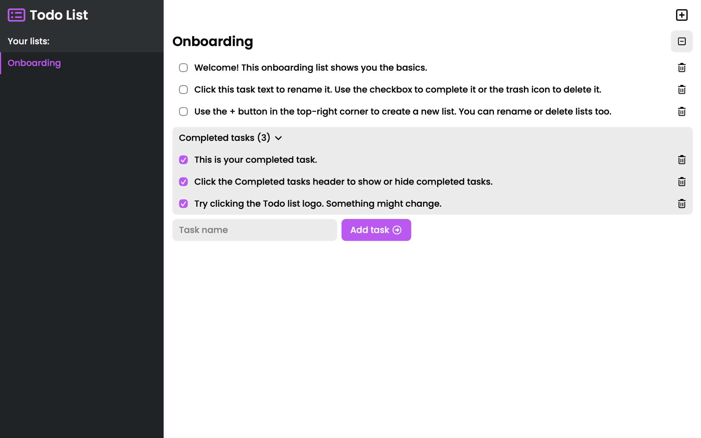
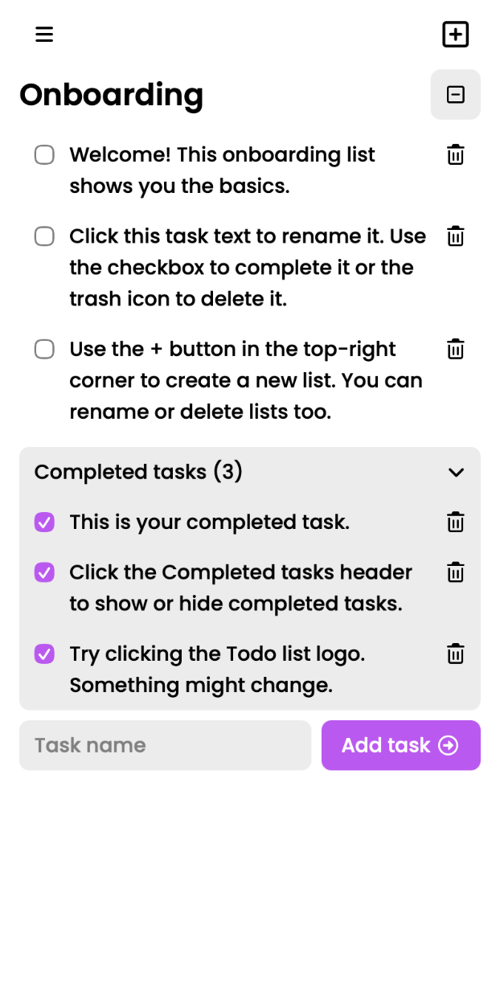

# Todo List

**A ready-to-use todo list app built with React for creating lists and organizing tasks.**

**See live preview:** [Todo List](https://pospisilvitek.github.io/todo-list/)

## Preview

<table>
    <tr>
        <td colspan="2">
            
        </td>
    </tr>
    <tr>
        <td width="50%">
            
        </td>
        <td width="50%">
            
        </td>
    </tr>
</table>

## Features

- Create separate lists to group related tasks. Lists can be **added through a modal**, **renamed** and **deleted with a confirmation step**.
- Add tasks to the selected list. Tasks can be **added**, **renamed**, **marked as completed** and **deleted**. Completed tasks can be **hidden or shown**.
- The app includes **responsive layouts**, **helpful empty states**, **color themes** and **mobile app icons with a web manifest**.
- Data is saved in **localStorage**, including **lists**, **tasks**, the **selected list**, **completed tasks visibility** and the **selected color theme**.

## Built with

This project was built with [React](https://react.dev), [Vite](https://vite.dev) and custom CSS.

Additional libraries used in this project:

- Icons used in the interface are provided by [Font Awesome](https://fontawesome.com).
- Task textareas are powered by [react-textarea-autosize](https://github.com/Andarist/react-textarea-autosize).
- Unique list and task IDs are generated with [uuid](https://github.com/uuidjs/uuid).

## Notes

This is a personal portfolio project built to practice React, component structure, state management, localStorage, and responsive CSS.

No license is currently provided.